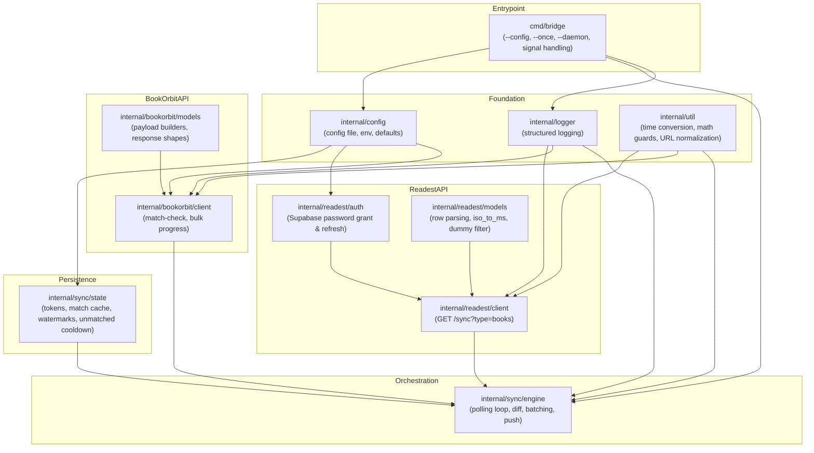

# Implementation Roadmap

This is a dependency graph for building the standalone Readest → BookOrbit bridge, not a generic timeline. Arrows show *depends on*.

---

## Dependency Graph

---

## Phase Descriptions

Each phase can be developed, unit-tested, and reviewed before the next. Phases with the same number may proceed in parallel.

### Phase 0 — Project skeleton

- Create Go module, directory layout (`cmd/bridge`, `internal/config`, `internal/logger`, `internal/util`, `internal/readest`, `internal/bookorbit`, `internal/sync`).
- Add `configs/bridge.example.yaml` with documented defaults.
- Wire a minimal `main.go` that parses `--config` and exits cleanly.

**Blocking for:** everything else.

### Phase 1 — Config + utilities

- Implement `internal/config`:
  - Readest: email, password, optional Supabase URL/anon key.
  - BookOrbit: server URL, username, password or pre-hashed `userkey`, optional device name/id.
  - Bridge: poll interval, retry/backoff settings, log level, state-file path, batch sizes.
- Implement `internal/util`:
  - ISO 8601 → unix-ms conversion (port of `iso_to_ms`).
  - Percentage calculation from `[cur, total]` with zero-guards.
  - BookOrbit server URL normalization.
  - MD5 helper for `x-auth-key`.

**Blocks:** readest/auth, bookorbit/client.

### Phase 2 — Logging + state store

- Implement `internal/logger` (structured, level-aware).
- Implement `internal/sync/state`:
  - Readest tokens (`access_token`, `refresh_token`, `expires_at`, `expires_in`).
  - Per-hash match records (`bookFileId`, `bookId`, `lastPushedAt`, `lastPushedPct`).
  - Unmatched cooldown map.
  - Global watermark for Readest pull cursor.
  - Atomic save / load (JSON or SQLite). Use file permissions `0600`.

**Blocks:** sync engine. **Can proceed in parallel with Phase 1.**

### Phase 3 — Readest authentication

- Implement `internal/readest/auth`:
  - `SignIn(email, password)` against `POST /auth/v1/token?grant_type=password`.
  - `Refresh()` against `POST /auth/v1/token?grant_type=refresh_token`.
  - `Token()` that applies the exact 50 % TTL rule and the 60-second guard.
  - Persist refreshed tokens via state store.

**Blocks:** readest/client. **Can proceed in parallel with Phase 4.**

### Phase 4 — Readest sync client

- Implement `internal/readest/models`:
  - Book row struct matching `parseSyncRow` output.
  - Dummy-hash filter.
  - Timestamp conversion.
- Implement `internal/readest/client`:
  - `PullBooks(since int64) ([]BookRow, error)` hitting `GET /api/sync?type=books&since=<ms>`.
  - Bearer-token auth via `auth.Token()`.
  - 401/403 handling with one refresh-and-retry.
  - Timeout and retry plumbing.

**Blocks:** sync engine.

### Phase 5 — BookOrbit client

- Implement `internal/bookorbit/models`:
  - `MatchCheckRequest` (hashes list + books array).
  - `MatchCheckResponse` (matches/unmatched/libraryVersion).
  - `BulkProgressRequest` with device wrapper and items array.
- Implement `internal/bookorbit/client`:
  - `Auth()` (optional health check).
  - `MatchCheck(hashes, candidates)` → cached mappings.
  - `BulkProgress(items)` bulk upload.
  - Fallback `UpdateProgress(...)` single-item PUT (optional but recommended for version fallback).
  - Request signing with `x-auth-user` / `x-auth-key`, JSON body size guard, timeouts.

**Blocks:** sync engine.

### Phase 6 — Sync engine

- Implement `internal/sync/engine`:
  - `RunOnce(ctx)`:
    1. Ensure Readest token fresh.
    2. Pull books since watermark.
    3. Filter deleted/dummy rows.
    4. Compute percentage for each changed row.
    5. Skip unchanged percentages.
    6. Match-check unknown hashes in batches of 500.
    7. Push matched books in batches of 100 via `BulkProgress`.
    8. Update state: watermarks, match cache, unmatched cooldown, last push per book.
  - `Run(ctx)` loops `RunOnce` with configurable sleep, graceful on `context.Canceled`.
  - Error handling: auth errors → fail fast; transient HTTP → exponential backoff per batch; unmatched → cooldown, never fail the run.

**Depends on:** Phases 2, 3, 4, 5.

### Phase 7 — CLI + packaging

- Finish `cmd/bridge`:
  - `--config`
  - `--once` (single run, suitable for cron/systemd timers)
  - `--daemon` / default daemon mode
  - Signal handling (`SIGINT`/`SIGTERM` for graceful shutdown)
  - Initial setup / login helper if tokens missing and password provided.
- Add `configs/bridge.example.yaml`.
- Add `systemd/` example unit file.
- Create a `Makefile` or build script for a static Linux binary.

**Depends on:** Phase 6.

### Phase 8 — Tests + integration validation

- Unit tests for every Phase 1–5 module using mocked HTTP transports.
- Table-driven tests for `iso_to_ms`, dummy hash filter, percentage calc, URL normalization, batching.
- Integration test (manual) against a real Readest account and a real BookOrbit server:
  - Verify a book read on Readest appears in BookOrbit with the correct percentage.
  - Verify no duplicate pushes after unchanged progress.
  - Verify token refresh mid-run.
  - Verify deleted/unmatched books are handled gracefully.

**Depends on:** Phase 7, but test scaffolding can start after Phase 4/5.

---

## Milestone Acceptance Criteria

1. **Milestone 1 (end of Phase 5):** The bridge can authenticate to Readest, pull the books table, authenticate to BookOrbit, and call `match-check` successfully from `--once`.
2. **Milestone 2 (end of Phase 7):** A full `--once` run pushes progress for all changed books to BookOrbit and advances the watermark.
3. **Milestone 3 (end of Phase 8):** Daemon mode runs continuously, refreshes tokens, handles transient failures, and passes integration tests.

---

## Notes

- **No KOReader code is copied.** The plugins are treated as executable specifications only.
- **Two endpoints are authoritative:** `GET /sync?type=books` and `POST /koreader/plugin/progress`.
- **State is the only persistence.** The bridge does not read book files, sidecars, or `statistics.sqlite3`.
