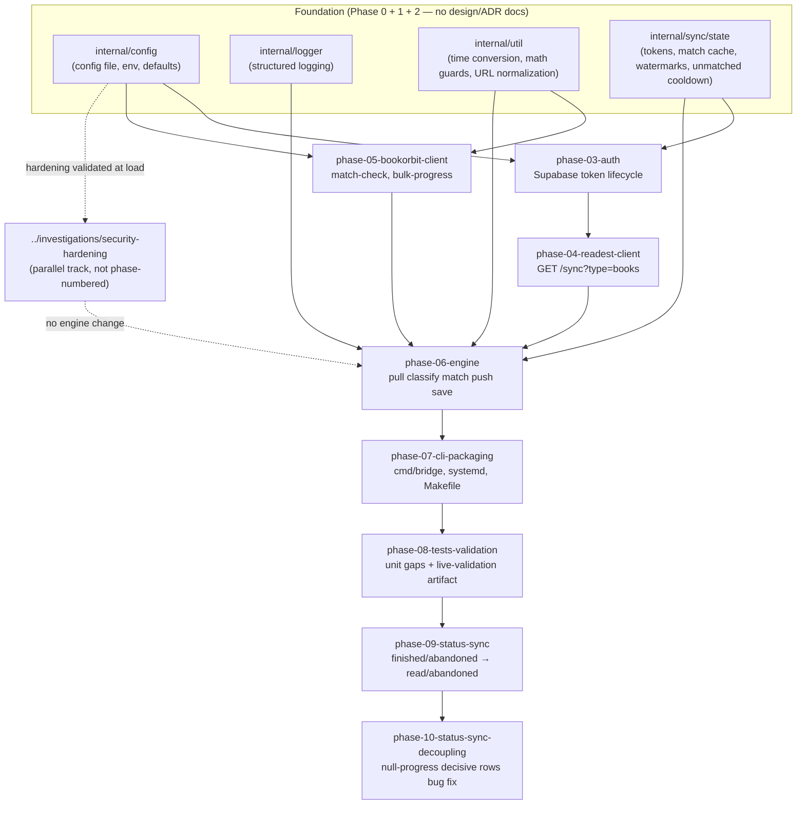

# Phases — One Folder Per Phase

Every phase this project has shipped lives here. The phase is the primary unit
of shipped work; grouping by phase (rather than by doc-type as `docs/adr/` did
pre-reorg) matches the project's own mental model — every phase is its own
self-contained chunk with its own design, ADR, and shipped tests.

## Folder layout

Each `phase-NN-<topic>/` folder contains exactly three files:

| File | Role | Mutability |
|---|---|---|
| `README.md` | One-page hub with the §2.2 template (status, depends on, what shipped, **what shipped differently from the design**, live-validation items, tests). | Living — updated when an ADR addendum lands. |
| `design.md` | The design doc at approval time — **historical record**. Per project convention (recorded in [`../internals.md`](../internals.md)): never edited except to add a header banner pointing to the hub README's "What shipped differently" section when an ADR supersedes part of it. | Frozen at approval. |
| `decision-record.md` | The as-implemented ADR: deviations, addenda, live-server invalidations, verification pass. The "as-built" account that any *current* contributor work should reference instead of the design doc. | Append-only (addenda only — never edit a recorded decision). |

## Dependency graph

## Milestone acceptance criteria (from `../implementation-roadmap.md`)

1. **Milestone 1 (end of Phase 5):** The bridge can authenticate to Readest,
   pull the books table, authenticate to BookOrbit, and call `match-check`
   successfully from `--once`.
2. **Milestone 2 (end of Phase 7):** A full `--once` run pushes progress for
   all changed books to BookOrbit and advances the watermark.
3. **Milestone 3 (end of Phase 8):** Daemon mode runs continuously, refreshes
   tokens, handles transient failures, and passes integration tests.

(Phases 9 and 10 were inserted after the original roadmap was written; they
extend the bridge beyond the progress-only MVP scope defined in
`../problem-statement-prompt.md` and `../implementation-brief.md`.)

## If you only have 5 minutes

Open [`phase-06-engine/README.md`](./phase-06-engine/README.md) — Phase 6 is
the load-bearing phase (the `pull → classify → match → push → save`
orchestration), and its hub README's "What shipped DIFFERENTLY from the design"
section names the two live-server invalidations that rewrite the engine's
behavior from what the design doc alone describes.
